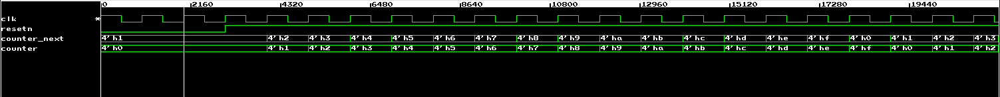
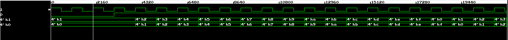
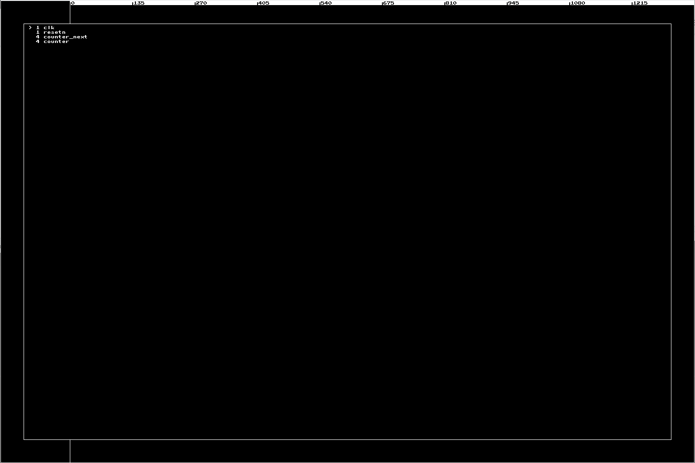

# PGE Wave

This is a VCD wave viewer written in C++ using the olcPixelGameEngine. This viewer is intended to address some of my UX frustrations with GTKWave, but will probably not suit many people's style of working. It's in active development and is missing many features. See the bottom of the README for a (non-exhaustive) list of things to be added.

Key bindings can be customised in `include/config.h`.

`test_rtl` contains verilog to generate vcd files and a cocotb testbench to drive it. To generate a VCD file run `make` in the `test_rtl` directory, you need cocotb and icarus installed. 

## Screenshots

Rendering single bit and multi-bit waveforms:

Toggle-able value overlay on name panel:

Picker for adding additional waveforms:

## Major Missing Features

This tool is in active development. A subset of missing features that are critical to usability:

- Parsing and displaying a module hierarchy
- A status bar showing things like cursor position and other state variables
- Saving and recalling wave layouts
- Removing (or moving) waves that have been added
- Logical/bus operations to modify signals
- Groupings
- Showing Xs
- Composite types
- Resolution hard coded
- Vertical scrolling for larger numbers of signals